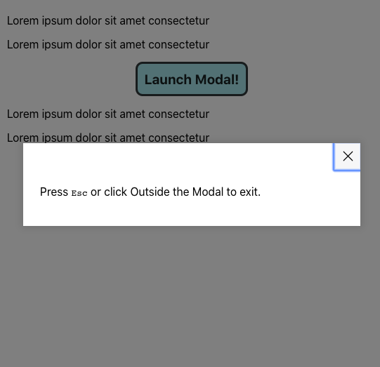

# Modal Specifications

Your aim is to create a React component that displays a modal. A Modal is an overlay on the web-page as shown in the picture below.

## Requirements

- The Modal component should be re-usable and a module that can be shared.
  - You component should be able to render multiple modals by calling the component multiple times.
  - It should have a defined input interface and a defined output.
  - You need to design an API letting the user override in-built functionalities as they please.
  - All the over-ridable APIs need to have sensible defaults.
- The modal should be accessible according to the modern web accessibility practices. Read more [here](https://www.w3.org/TR/wai-aria-practices-1.1/#dialog_modal).
